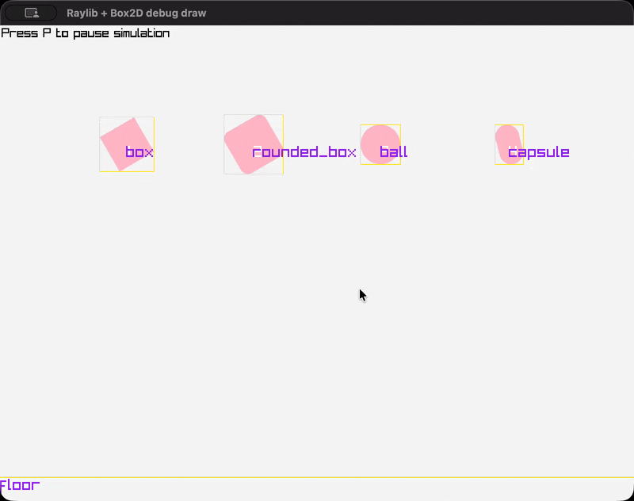

# Raylib Box2D Debug Draw
Implementation of [Box2D](https://box2d.org/)'s `b2DebugDraw` using [Raylib](https://www.raylib.com/) for drawing.

Use this in games made with raylib for debug drawing Box2D worlds.




## Usage example
```c
#include <box2d/box2d.h>
#include <raylib.h>
#include <raylib_box2d_debugdraw.h>


void debug_draw_box2d_world(b2WorldId world) {
    // 1. Call b2RaylibDebugDraw to create the b2DebugDraw
    b2DebugDraw debug_draw = b2RaylibDebugDraw();
    
    // 2. Setup what you want to be drawn
    debug_draw.drawBodyNames = true;
    debug_draw.drawShapes = true;
    debug_draw.drawBounds = true;
    debug_draw.drawContacts = true;

    // 3. (optional) Configure font size and Transform axis colors and length
    b2RaylibDebugDrawConfig debug_draw_config = {
        .fontSize = 20,
    };
    debug_draw.context = &debug_draw_config;
    
    // 4. Call b2World_Draw to debug draw the world
    b2World_Draw(world, &debug_draw);
}

void game_loop() {
    while (!WindowShouldClose()) {
        b2World_Step(world, 1.0 / 60.0, 4);
    
        // Drawing Box2D worlds with raylib should happen inside
        // BeginDrawing / EndDrawing, just like everything else.
        // If using a Camera2D, ensure the same camera is active
        // while debug drawing Box2D for positions on screen to match.
        BeginDrawing();

            ClearBackground(RAYWHITE);
            
            debug_draw_box2d_world(world);

        EndDrawing();
    }
}
```


## Integrating with CMake
You can integrate Raylib Box2D Debug Draw with CMake targets by adding a copy of this repository and linking with the `raylib_box2d_debugdraw` target:
```cmake
add_subdirectory("path/to/raylib-box2d-debugdraw")
target_link_libraries(my_awesome_target raylib_box2d_debugdraw)
```


## Integrating with other build systems
Otherwise, include [raylib_box2d_debugdraw.h](raylib_box2d_debugdraw.h), compile [raylib_box2d_debugdraw.c](raylib_box2d_debugdraw.c) and link it with your app and you're good to go.
Requires linking with Raylib and Box2D.
